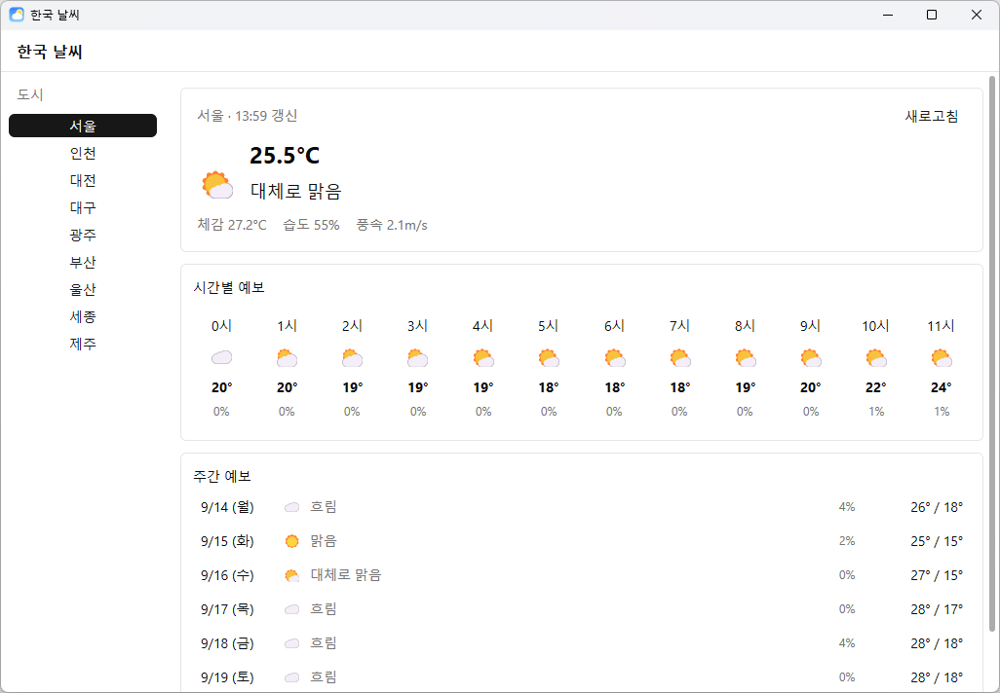

# 한국 날씨

테스트용 GPUI 날씨 앱.



## 다운로드

[Releases](../../releases)에서 `weather-app-Setup-0.1.0.exe` 다운로드 후 실행.

## 개발

```sh
cargo run
```

## 크레딧

- 앱 아이콘(`assets/icon.ico`): [Makin-Things/weather-icons](https://github.com/Makin-Things/weather-icons) (MIT, AmCharts 스타일 기반)
